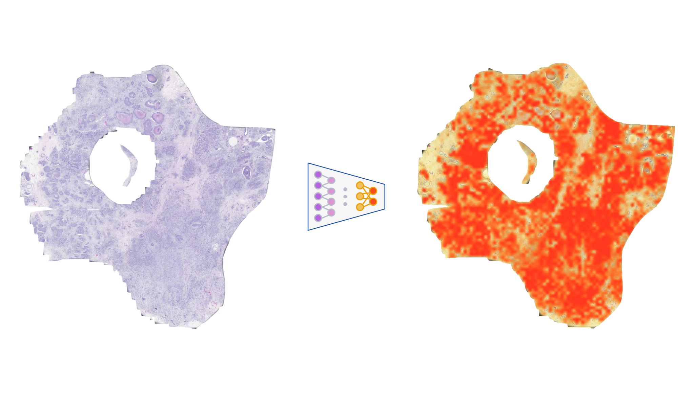

## Deep Learning Identifies Morphological Features in Breast Cancer Predictive of Cancer *ERBB2* Status and Trastuzumab Treatment Efficacy

___



### :file_folder: Sample data and models
[Download link (~3.3Gb)](https://www.dropbox.com/sh/mi0hixo1l18j128/AADDz2jX9JSRbkciGFdm7rBDa?dl=1)

```
he-erbb2-github-data
 ├── tissue-samples
 │    ├── [ sample 1 ]
 │    ├──     ...
 │    └── [ sample n ]
 └── models
      └── Her2
           ├── fold-1.pth
           ├── fold-2.pth
           ├── fold-3.pth
           ├── fold-4.pth
           └── fold-5.pth
    
```

### 	:microscope: Inference
Attach to the docker container and run:
```
python inference.py -c configs/inference-config.json
```
The script generates a `.csv` file with predicted scores.


### :gear: Running docker image
- Clone the Repository
- CD to the docker folder `cd docker`
- Edit "DATA_VOLM" path in `init-docker.sh` - point to the data you downloaded through the linkd, e.g. `/your/path/he-erbb2-github-data/`. Other variables can remain default.
- Build an image: `./build-docker.sh`
- Run a container: `./run-docker.sh`
  - Containers run in an interactive mode
  - <kbd>control</kbd> + <kbd>p</kbd>, <kbd>control</kbd> + <kbd>q</kbd> will turn interactive mode into daemon mode, i.e. detach from a container without stopping it
  - Reattach container: `docker attach [name]`
  - `Warning:` <kbd>control</kbd> + <kbd>a</kbd> <kbd>d</kbd> – detach from TMUX session when inside a container. This will kill the container!

### :page_with_curl: Cite
*Scientific Reports* [PDF](https://www.nature.com/articles/s41598-021-83102-6.pdf)
<br>[https://www.nature.com/articles/s41598-021-83102-6](https://www.nature.com/articles/s41598-021-83102-6)
<br>DOI: [https://doi.org/10.1038/s41598-021-83102-6](https://doi.org/10.1038/s41598-021-83102-6)

> Bychkov, D., Linder, N., Tiulpin, A., Kücükel, H., Lundin, M., Nordling, S., Sihto, H., Isola, J., Lehtimäki, T., Kellokumpu‑Lehtinen, PL., von Smitten, K., Joensuu, H., Lundin, J. Deep learning identifies morphological features in breast cancer predictive of cancer ERBB2 status and trastuzumab treatment efficacy. Sci Rep 11, 4037 (2021)

### :pencil: License	

This code is freely available only for research purposes. Commercial use is not allowed by any means.
